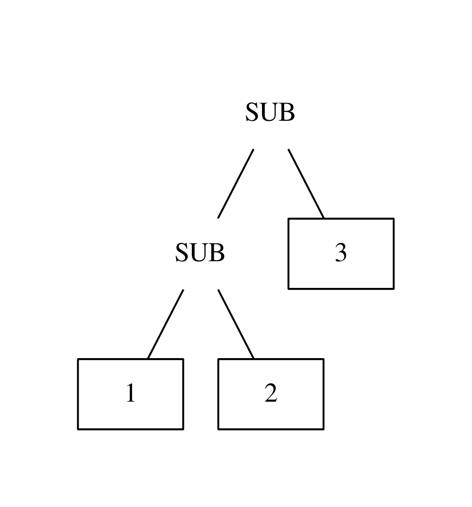
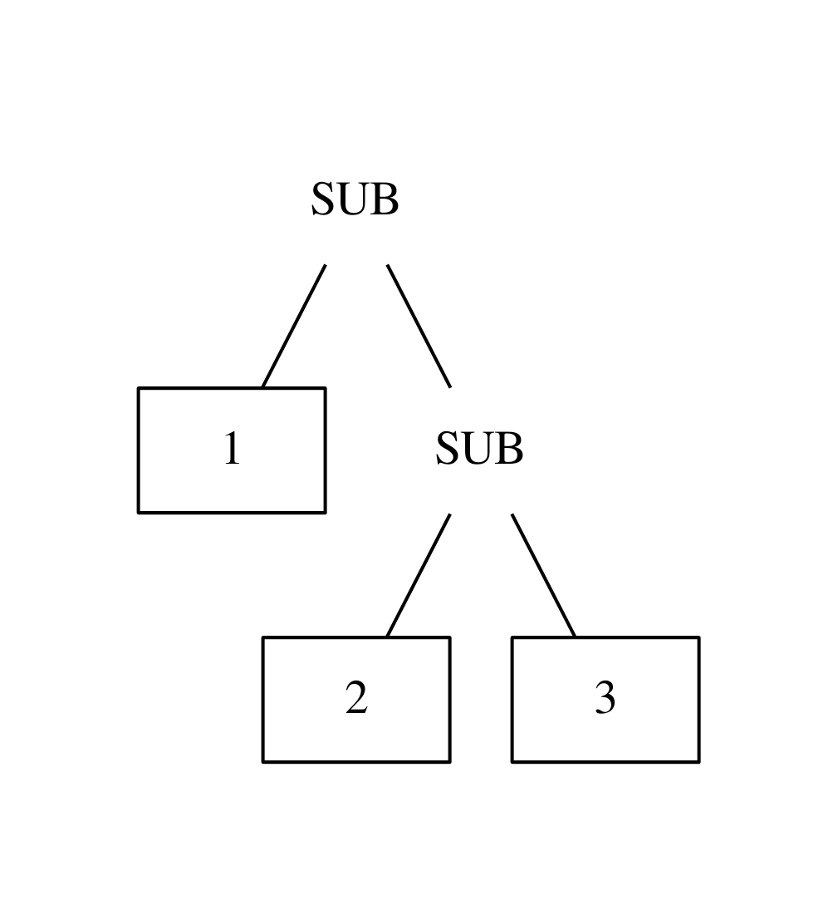

# September 24, 2023 - Problem with Left-Associative Operators

I have been having problems with creating parse trees using recursive descent
for left-associative operators. Recursive descent isn't capable of handling
gramamr with left-recursion. However, if you eliminate left-recursion in
grammar, the operators become right-associative.

Here is an example of a parse tree that is left-associative vs
right-associative for the expression `1-2-3`:

For an expression like `1-2-3` we usually want the left-associative parse tree.
There are many ways of handling this problem while still using a recursive
descent parser.

## Shunting Yard Algorithm

The Shunting Yard Algorithm is one of the ways to handle precedence. Basically,
it converts infix notation such as to Reverse Polish Notation a postfix
notation, or to an AST. It uses an output buffer and an operator stack. It
pushes or pops operators into the stack based on the precedence of the current
operator and the operator at the top of the stack. It would convert an
expression in infix notation: `3 + 4 * 2 / ( 1 − 5 ) ^ 2 ^ 3`, to a postfix
notatation: `3 4 2 * 1 5 − 2 3 ^ ^ / +`.

Resources:

- [Shunting Yard Algorithm - Wikipedia](https://en.wikipedia.org/wiki/Shunting_yard_algorithm)
- [Parsing Expressions by Recursive Descent (Shunting Yard Algorithm) - Theodore Norvelle](https://www.engr.mun.ca/~theo/Misc/exp_parsing.htm#shunting_yard)

## Pratt Parsing

Pratt Parsing basically uses the Shunting Yard Algorithm but implements it
recursively. It seems like there's some differences, such as Pratt Parsing
having "binding power" that handles both precedence and associativity, but
apparently it is the same algorithm. It's also the same algorithm as Precedence
Climbing.

Resources:

- [Simple but Powerful Pratt Parsing - Alex Kladov](https://matklad.github.io/2020/04/13/simple-but-powerful-pratt-parsing.html)
- [From Pratt to Dijkstra - Alex Kladov](https://matklad.github.io/2020/04/15/from-pratt-to-dijkstra.html)
- [Parsing Expressions by Recursive Descent (Precedence Climbing) - Theodore Norvelle](https://www.engr.mun.ca/~theo/Misc/exp_parsing.htm#climbing)

## Packrat Parsing

Packrat Parsing takes advantage of memoization to handle left-recursive grammar
directly. The gist of it is that instead of going into recursion, it tries to
instead find a result from the cache. If there is no cache, it simply results in
failure and moves on to the next production. This then puts a result in the
cache and tries all of the productions from the beginning again. It looping once
it parses a shorter length in the next loop. The parse with the biggest length
is used.

Resources:

- [Peg Parsing Series - Guido Van Rossum](https://medium.com/@gvanrossum_83706/peg-parsing-series-de5d41b2ed60)
- [Packrat Parsers can Support Left Recursion - Warth et al.](https://github.com/amadeusdotpng/compiler/blob/main/papers/Packrat_Parsers_Can_Support_Left_Recursion.pdf)
