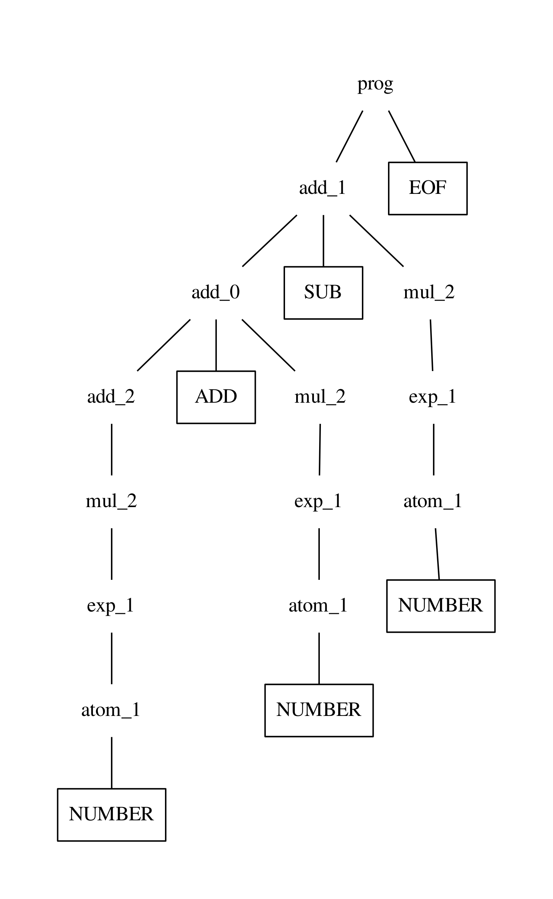

# October 3, 2023 - Writing a Packrat Parser

I have been able to successfully write a Packrat Parser for basic arithmetic
expressions. It includes addition, subtraction, multiplication, division,
exponents, and parenthesis. 

## Grammar

Here is the grammar that the parser follows.

```
parse
	| add EOF

add : add + mul | add - mul
	| mul

mul : mul * exp | mul / exp
	| exp

exp : atom ^ exp
	| atom

atom: (add)
	| NUMBER

```

The nonterminal `parse` is the starting symbol, which immediately goes to the
nonterminal `add`. It also uses the terminal `EOF` so that the parser doesn't
have to worry about edge cases for the end of the file. 

## Left-Recursion in Packrat Parsing

Packrat Parsing uses memoization to guarantee linear parse time. It can also be
modified to be able to handle left-recursion. This is done by going through each
production of a nonterminal and caching the result of the first successful
production. The cache is primed to always result in a failure during this first
loop so that left-recursive productions don't cause infinite recursion. Then,
the parser loops through all of the productions again but uses the cached newly
cached result. This goes on, parsing a bigger portion of the string each time,
until it parses a shorter portion of the string compared to the last loop.

## Walkthrough of the Code

To better understand how it works, we can walk through the code for parsing a
simple expression `1+1-1`. The full code is
[here](https://github.com/amadeusdotpng/compiler/blob/main/src/protopy/simple_packrat.py)
if you want to follow along using the full code. This also closely follows Guido
Van Rossum's article
[Left-recursive PEG Grammars](https://medium.com/@gvanrossum_83706/left-recursive-peg-grammars-65dab3c580e1).
and the code for the memoization of the parser.


```python
def left_memoize(self, func):
	save = self.mark()

	key = (func, save)
	if key in self.memo_table:
		res, endpos = self.memo_table[key];
		self.reset(endpos)
	else:
		# Guarantees failure for left-recursive productions
		self.memo_table[key] = lastres, lastpos = None, save
		while True:
			self.reset(save)

			res = func()
			endpos = self.mark()

			if endpos[1] <= lastpos[1]:
				break

			self.memo_table[key] = lastres, lastpos = res, endpos

		res = lastres
		self.reset(lastpos)
	return res
```
This is the memoization function used for left-recursive nonterminals. The
nonterminal is passed in as an argument `func` to be able to be used as a key
and also be able to be called inside of the loop.

Let's get started by calling the function for the starting symbol `parse`. It
runs this piece of code:
```python
def parse(self):
	res = bool((add0 := self.left_memoize(self.add)) and
			   (tok0 := self.expect(Token.EOF)))

	if add0:
		return (res, PTNode("prog", [add0, tok0]))
	return (res, None)
```
This calls `left_memoize()` for the nonterminal `add`. Since the nonterminal
hasn't been cached yet at this position, 0, it goes to the `else` branch and
caches a `None` and position 0. It then goes into the loop which calls the `add`
function. From the grammar, the nonterminal has three productions. It calls the
first production
```python
def add_0(self):
	res = bool((add0 := self.left_memoize(self.add)) and
			   (tok0 := self.expect(Token.ADD)) and
			   (mul0 := self.left_memoize(self.mul)))
	if res:
		return [add0, tok0, mul0]
	return None
```
This again calls `left_memoize` for `add`, however since it's now cached, it
returns `None` as its result and makes the production fail. The same happens for
the second production. However the third production goes into nonterminal `mul`.
Since `mul` is also left-recursive it goes through a similar process. This is
until it reaches all the way to the nonterminal `atom` and is able to return the
terminal `NUMBER`.

The third production is a success and now it's returned to the initial loop
inside of `left_memoize()`. Since the ending position went further, it caches
the result. It starts all over. However, when the first production is called,
`add_0`, it doesn't immediately fail. `self.left_memoize(self.add)` returns the
terminal `NUMBER`, which is a success. The pointer is now moved up one position,
so `self.expect(Token.ADD)` is a success and moves the pointer up one position.
`self.left_memoize(self.mul)` eventually becomes a success after going through
memoization and returns the terminal `NUMBER`. It has now parsed `1+1` so far. 

Since the production is a success, the result is cached and it starts over
again. This time, when the second production is called
```python
def add_1(self):
	res = bool((add0 := self.left_memoize(self.add)) and
			   (tok0 := self.expect(Token.SUB)) and
			   (mul0 := self.left_memoize(self.mul)))
	if res:
		return [add0, tok0, mul0]
	return None
```
`self.left_memoize(self.add)` returns `1+1` and the pointer is moved up three
positions with `-1` left remaining to parse. Like last time, it is able the rest
of the string and returns `1+1-1`. The result is cached and it over again.

However, this time the first two productions will be a success since
`self.left_memoize(self.add))` will keep returning `1+1-1` and
`self.expect()` will keep failing for each production since the only terminal
left is the `EOF` terminal, or end of file. Since the first two productions were
failures, it calls the last production. Although it is a success, when it
returns to the loop, it notices that it didn't parse as much as it did in the
last loop. The loop breaks, and the result isn't cached. The result last cached
is now returned to the initial call of `left_memoize()` at `parse()` with the
result of `1+1-1`. Then it parses for the `EOF` terminal, which is a success and
returns the tree built.

<div align="center">

</div>

## Not a full Packrat Parser

Although this parser does fully work, this isn't a true Packrat Parser since it
doesn't memoize every nonterminal, only left-recursive ones. This will be
implemented in the final Rust version of the parser.

