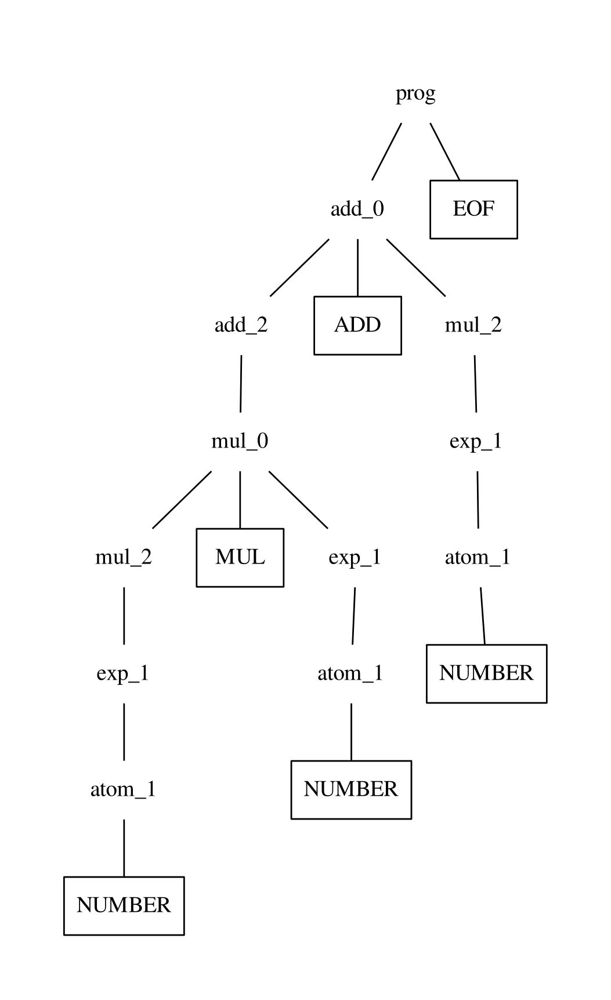

# October 16, 2023 - Printing Parse Trees Using DFS

The trees generated by parser were printed through recursively visiting the
child of the each ndoe and printing its contents. The structure of the tree was
kept by using parentheses. For example the parse tree,

<div align="center">

</div>

can be represented by
```
(prog 
	(add_0 
		(add_2 
			(mul_0 
				(mul_2 
					(exp_1 
						(atom_1 
							NUMBER
						)
					)
				) 
				MUL 
				(exp_1 
					(atom_1 
						NUMBER
					)
				)
			)
		) 
		ADD 
		(mul_2 
			(exp_1 
				(atom_1 
					NUMBER
				)
			)
		)
	) 
	EOF
)
```

generated by

```python
def __str__(self):
	return self.tree_string(0)

def tree_string(self, level):
	indent = level*"    "
	res = f"{indent}({self.type} "
	for child in self.children:
		if type(child) == Token:
			res += f"\n{indent+'    '}{child.name}"
		else:
			res += f"\n{child.tree_string(level+1)}"
	res += f"\n{indent})"
	return res
```

It adds an indentation level after visiting a child of a node. Then the ending
parenthesis can be printed after visiting each children. However, this recursive
implementation cannot handle large expressions. Switching over to an iterative
implementation can help solve this problem.

The parse tree can be traversed by using Depth First Search (DFS) to visit each
child.

```python
def treeString(node):
    res = ""
    Q = LifoQueue()
    Q.put(node)
    while not Q.empty():
        L, v = Q.get()
        if type(v) == PTNode:
            res += f"{v}"
            for child in reversed(v.children):
                Q.put(child)
        elif type(v) == Token:
            res += f" {v.name}"
        prevL = L
    return res
```

It uses a stack to traverse down the tree and backtrack to after a node
doesn't have any more children. The children of the node must be put into the
stack in reverse order to traverse the children in the proper, left-to-right,
order. This manages to visit each node in the tree, however it has lost its
hierarchal structure. To fix this, we can add a similar `level` property to each
node, keeping track of how deep it is in the tree.

```python
def treeString(node):
    res = ""
    Q = LifoQueue()
    Q.put((1, node))
    prevLevel = 1
    while not Q.empty():
        level, v = Q.get()
		res += ")"*(prevL-L)
        if type(v) == PTNode:
            res += f" ({v}"
            for child in reversed(v.children):
                Q.put((L+1, child))
        elif type(v) == Token:
            res += f" {v.name}"
        prevL = level
    res += ")"
    return res
```

This works differently from the recursive implementation as it uses `level` and
`prevL` to determine how many ending parentheses should be printed out. If the
current level is less than the previous level, meaning that we've backtracked up
higher in the tree, then the ending parentheses get printed. It outputs the same
tree. however the indentation level is now gone. However it isn't too important
as this is only used to visualize the tree by using a program such as
[ParseViz](http://brenocon.com/parseviz/).
